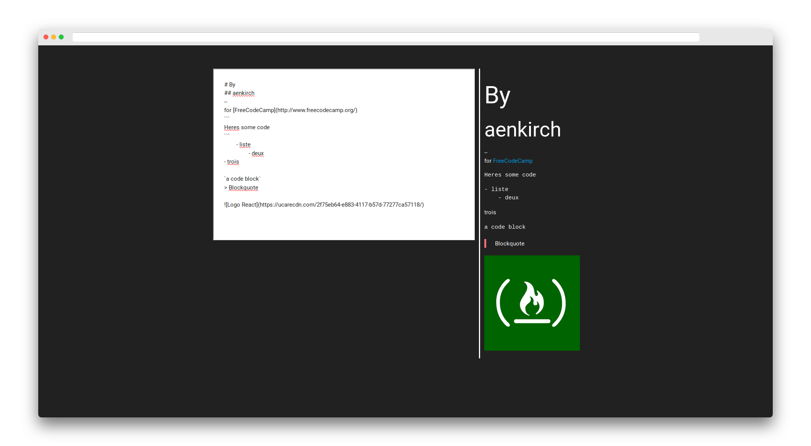

<h1 align="center">
    Markdown Previewer
</h1>

    1st ever project I made using React, submitted for the front-end libraries <a src="http://freecodecamp.org">FreeCodeCamp</a> course.
    

---

## Features

* Type in your markdown formatted text and get a preview of what your text looks like live

---

## Technologies used

* React
* Marked.js